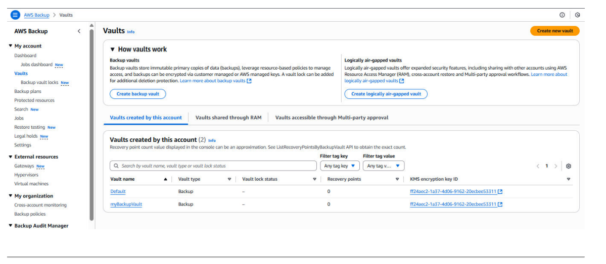
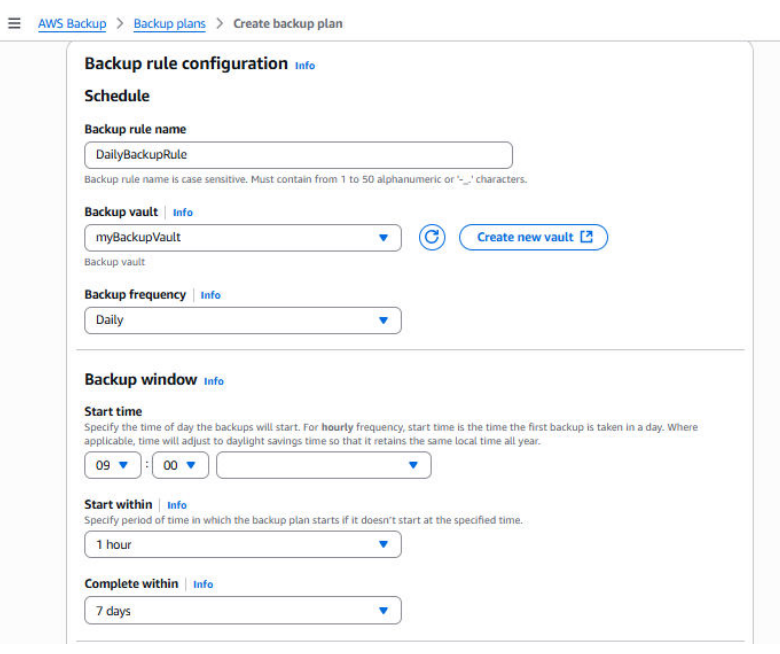
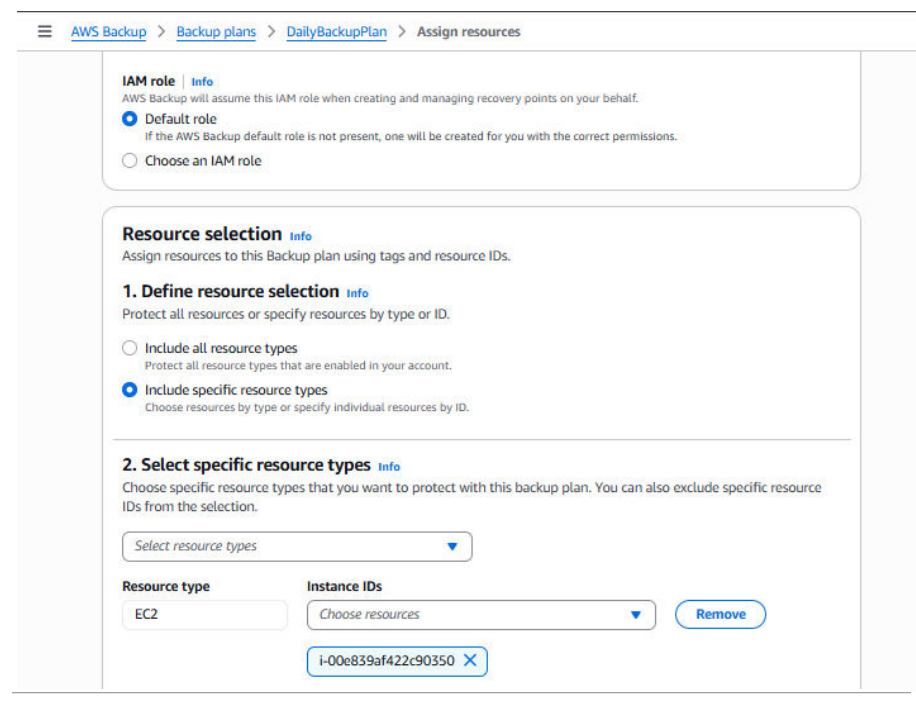
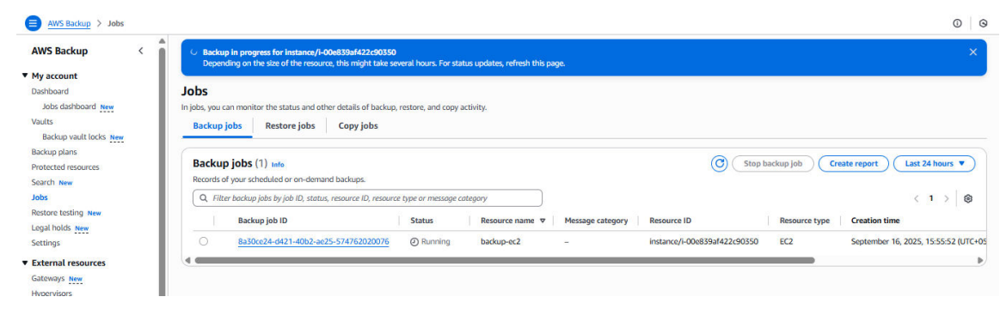
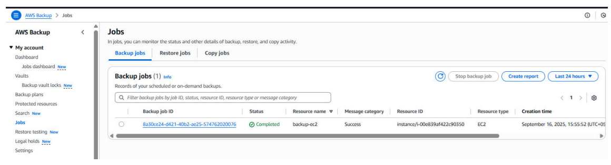
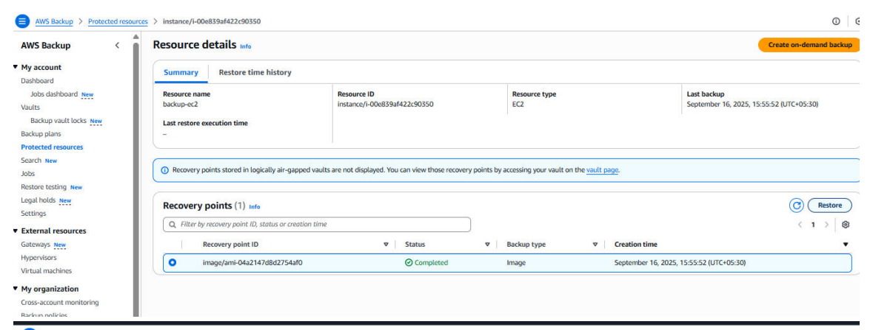
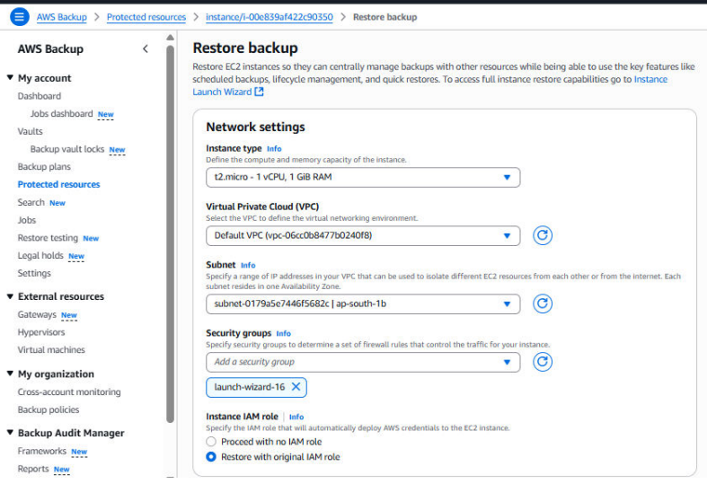

# 🔹 2. Backup Solution Using AWS EC2 Instances

### Step 1: Create Backup Vault
- Navigate to: **Console** → **AWS Backup** → **Backup vaults** → **Create vault**

- Set the following:
  - **Name:** `myBackupVault`
  - **Encryption:** Default AWS key or CMK

### Step 2: Create Backup Plan
- Go to **Backup Plans** → **Create**.
- Name: `DailyBackupPlan`
  
  **Add rule:**  
  &nbsp;&nbsp;&nbsp;&nbsp;• **Name:** `DailyBackupRule`  
  &nbsp;&nbsp;&nbsp;&nbsp;• **Frequency:** Daily @ 9:00 PM UTC  
  &nbsp;&nbsp;&nbsp;&nbsp;• **Retention:** 30 days  
  &nbsp;&nbsp;&nbsp;&nbsp;• **Vault:** `myBackupVault`
  

### Step 3: Assign Resources

- Select `DailyBackupPlan` → **Assign resources**.

---

### Name: `BackupEC2Resources`  
**Type:** EC2 instance  
**Instance ID:** `i-0123456789abcdef0`

---
### Step 4: Run On-Demand Backup

- Navigate to: **Backup Plan** → **Create on-demand backup**
- Set the following:
  - **Resource type:** EC2 instance  
  - **ID:** `i-0123456789abcdef0`  
  - **Vault:** `myBackupVault`
  
- Monitor the progress under **Backup Jobs**

## Step 5: Automate Snapshot Creation Using AWS Backup (Handled by Backup Plan)
- The AWS Backup service automatically creates snapshots and backup copies based on assigned backup plans—no additional automation tools are needed.
- For custom automation scenarios, you can use AWS Lambda with Amazon EventBridge (formerly CloudWatch Events) to trigger EC2 snapshots. However, the native AWS Backup service is recommended for simplicity and maintainability.

AWS Backup manages daily snapshot creation according to the schedules defined in your backup plan:
- When you assign an EC2 instance to a backup plan, AWS Backup automatically creates snapshots of the attached EBS volumes based on your specified schedule and retention settings.
- This removes the need for custom automation scripts or manual triggers using Lambda and EventBridge.
### Summary: Step 5 – Automation (Snapshots)
     Recommended: Handled automatically by AWS Backup plans
     Optional (Custom): Use AWS Lambda + EventBridge if advanced or non-standard logic is required

## Step 6: Restore from Backup
1. Navigate to Protected Resources or Backup Vault in the AWS Backup console.
2. Select the backup you want to restore.
3. Click Restore.
4. Choose your restore options, such as restoring to the original EC2 instance or launching a new one.
5. Confirm the restore action and monitor the progress.
 
 ###  Summary: Step 6 – Restore EC2
     - Go to Protected Resources → Backup Vault
     - Select the backup → Click Restore
     - Choose restore options (original instance or new EC2 instance)
     - Confirm and monitor the restore process

### Summary
**AWS Backup** → Vault + Plan + Assign Resources + (Optional) On-Demand Backup
