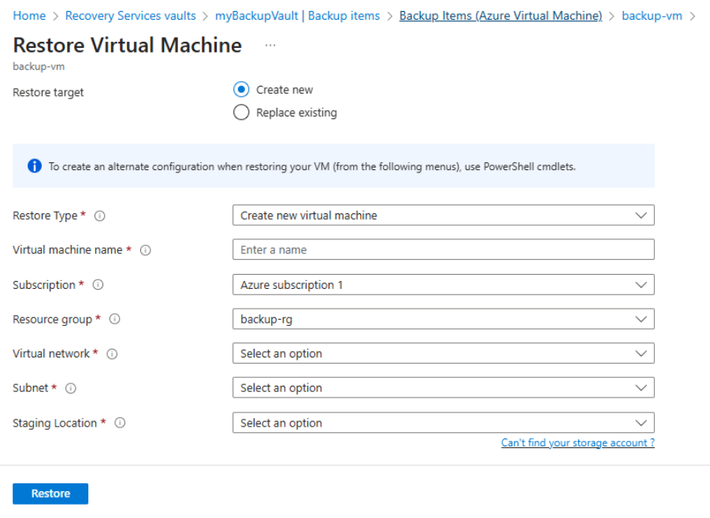

# 🔹 1. Backup Solution Using Azure VMs

## Step 1: Create a Recovery Services Vault

1. Sign in to the **Azure Portal**.
2. Navigate to: **Backup Center** → **+ Add** → Choose **Recovery Services Vault**.
3. Fill in the following details:
   - **Subscription:** `MySubscription`
   - **Resource Group:** `BackupRG`
   - **Vault Name:** `myBackupVault`
   - **Region:** Same as VM (e.g., `Central India`)
4. Click **Review + Create** → **Create**.
   ## Recovery Services Vault 

---

## Step 2: Configure Backup Policy

1. In the vault, go to: **Backup Policies** → **+ Add**.
2. Define the schedule:
   - **Frequency:** Daily @ 9:00 PM
   - **Retention:** 30 days
   - *(Optional)* Add weekly/monthly/yearly rules.
3. Save the policy as: `DailyBackupPolicy`.
   ## Create Policy

---

## Step 3: Enable Backup for VM

1. In the vault, go to: **Backup**
2. Configure the following:
   - **Workload Location:** Azure  
   - **What to back up?:** Virtual Machine  
   - **Select Vault:** `myBackupVault`
3. Click **+ Backup** and select the VM (e.g., `myAppVM`).
4. Assign the policy: `DailyBackupPolicy`.
5. Click **Enable Backup**.

> ℹ️ Azure installs the backup extension automatically.


---

## Step 4: Run On-Demand Backup

1. Go to: **Vault** → **Backup Items** → **Azure Virtual Machine**
2. Select the VM (e.g., `myAppVM`).
3. Click **Backup Now**.
4. Monitor status under **Backup Jobs**.


---

## ✅ Step 5: Automate VM Snapshot Creation Using Azure Logic Apps
### 1. Create a Logic App
1. Go to: **Logic Apps** → **Click**+**Create**
2. Fill in the following details:
   - **Name:** `VMSnapshotScheduler`
   - **Resource Group:** `BackupRG` (same as the VM backup group)
   - **Location:** `Central India`
   - **Plan:** `Consumption` (recommended)

### 2. Configure the Logic App Designer
### In the Logic App Designer:

- **➤ Trigger:**  
  Select `Recurrence` → Daily @ 9:00 PM
  Set:
  Frequency: Daily
  Time: 9:00 PM (or your preferred backup window)
  

- **➤ Action:**
-  Click + New Step → Choose `Azure Resource Manager` → **Select Create or Update Resource**
### Fill in the following fields:
| Field              | Value                                                                 |
| ------------------ | --------------------------------------------------------------------- |
| **Subscription**   | Your Azure subscription                                               |
| **Resource Group** | Same as your VM's resource group (e.g., `BackupRG`)                   |
| **Resource Type**  | `Microsoft.Compute/snapshots`                                         |
| **API Version**    | Latest (e.g., `2023-09-01`)                                           |
| **Location**       | Same as the VM (e.g., `Central India`)                                |
| **Name**           | `concat(variables('VMName'), '-snapshot-', utcNow('yyyyMMddHHmmss'))` |

### Properties:
{
  "creationData": {
    "createOption": "Copy",
    "sourceResourceId": "<Your OS disk Resource ID>"
  },
  "sku": {
    "name": "Standard_LRS"
  }
}

#### Resource Details:
- **Resource Type:** `Microsoft.Compute/snapshots`
- **Name:**
  ```text
  concat(variables('VMName'), '-snapshot-', utcNow('yyyyMMddHHmmss'))
  ```
- Properties:
 ```text
  {
  "creationData": {
    "createOption": "Copy",
    "sourceResourceId": "<Your OS disk Resource ID>"
  },
  "sku": {
    "name": "Standard_LRS"
  }
}
``` 
  
### 3. Save & Enable the Logic App
- Click Save
- Enable the Logic App
- This Logic App will now automatically run every day at 9:00 PM and create a snapshot of your VM’s OS disk.
  

### Step 6: Restore from Backup or Snapshot
1.  Go to: Vault → Backup Items → VM → Restore VM
2.  Select a restore point
3.   Choose to restore to:
- Original VM, or
- New VM
4. Confirm restore.
    
    

### ✅ Summary
**Recovery Services Vault** → Backup Policy + Enable Backup on VM + (Optional) Logic App for Snapshots

Azure Backup Flow:
- Recovery Services Vault
- Backup Policy
- (Optional) Logic App for snapshots
- On-demand or scheduled backups
- Easy restore from portal
